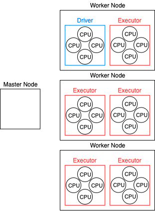

# Configuring a Spark Cluster

Apache Spark is a data processing powerhouse that requires patience, persistance, and proper configuration!
Given the appropriate configuration, a Spark deployment can churn reliably through terabytes of data using every available compute cycle.
Yet, with hundreds of different settings, it's difficult to know where to start.
In this post, I focus on the most important settings that should be your first consideration when configuring Spark.


## The Cluster

To properly configure Spark, it helps to understand how Spark maps onto the underlying cluster infrastructure.
The diagram below shows the typical layout of a Hadoop cluster.
Depending on where the driver is running, the master node might not be doing much, and most of the compute happens on worker nodes. For this reason,
it is common to provision a small master node and lots of beefy worker nodes.
Spark runs in separate processes called "executors"; one of these executors is special, it's called the "driver".
The driver parses the application, builds an execution graph, and decides how work will be distributed among the available executors. Each executor is configured with multiple cores and a shared memory pool.



## Top 5 Configuration Settings

Without a doubt, the most important aspect of Spark configuration is the settings for executor cores and memory. If you get this wrong, you will have an under-performing cluster that occasionally crashes due to memory errors. The five setting are listed below.

* `spark.driver.cores` - number of cores on the driver
* `spark.driver.memory` - amount of memory on the driver
* `spark.executor.cores` - number of cores for each executor
* `spark.executor.memory` - amount of memory on each executor
* `spark.executor.instances` - the total number of executors, including the driver

As an example, here is what the `spark-defaults.conf` file might look like for the cluster above.

```
spark.driver.cores          4
spark.driver.memory         6G
spark.executor.cores        4
spark.executor.memory       6G
spark.executor.instances    6
```

There are multiple ways to modify the configuration.
A Spark application first picks up the configuration from a file located at `${SPARK_HOME}/conf/spark-defaults.conf`.
Alternatively, these values can be overriden on the command line when a new Spark application is submitted.
I personally suggest changing the `spark-defaults.conf` file, but you can find more info in the [Spark Configuration Documentation](https://spark.apache.org/docs/latest/configuration.html).


## Configuring the Cores

When counting cores, consider the number of cores available on a single worker node and the number of executors that will be running on it.


> Rule 1: each worker node should have at least one core that is not allocated to an executor

This is because there are other processes running on the nodes outside of the executors, including the operating systems, resource manager, and other stuff. If your executors are hogging all of the cores, then you will starve these other processes of compute. Ideally, you would leave only one core avaible, any more than that would likely be a waste. However, this will depend on the resources. For example, on a eight-core machine, you would likely use two executors with 3 cores each, leaving 2 cores available. While not recommended, you *could* use a single executor with 7 cores, or even 7 executors with 1 core each.

> Rule 2: each executor should have three to five cores

Three to five cores is the magic zone where various performance trade-offs give optimal results.
On one hand, allocating more cores will increase the benefits that come with shared resources. However, this comes at the risk of bottle-necking on garbage collecting an excessively large memory pool.
The inverse it true for lesser cores. Using two or six cores per executor will not kill performance, but it will be less optimal.

> Pro Tip: make the driver the same size as the other executors, at least while developing

Now we're in a position to set `spark.executor.instances`.
Note that this setting counts the driver in addition to all of the executor instances.
In the example above, the number of instances is set to 6, one driver plus 5 executors.
This setting would be more precisely named `spark.executor.max_instances`, as Spark may actually instantiate less instances if it cannot find enough resources.

## Configuring Executor Memory

After you have decided on the number of cores per executor, it's time to figure out how much memory you have available.
Given the total memory available on a machine, there are multiple allocations to consider.
First, the operating system will take a sizable chunk, as expected.
Second, Yarn will need some of the available memory.
Third, what is left over can be distributed among the executors.

I like to think of the total memory as a salary ... first you take the federal tax (Operating System), and then state tax (Yarn), leave a slice for the 401k, and what you're left with is a pittance.

> Rule 3: leave at least 10% memory for Yarn

As a concrete example, lets take the AWS EC2 instance type m5.xlarge, which features 4 cores and 16GBs of memory. After accounting for the OS tax, Yarn is left with 12GBs of memory. Yarn takes its own tax of 10%, leaving 10.8GB left for Spark. Let's be generous and leave the extra 0.8GB for Yarn.
That leaves 10GB left for Spark. Assuming we use a single executor on this machine, we set `spark.executor.cores = 3` and `spark.executor.memory = 10GB`. You can find the comprehensive list of tax rates for every instance type in the AWS docs, [Tax Tables](https://docs.aws.amazon.com/emr/latest/ReleaseGuide/emr-hadoop-task-config.html).

By default, Spark will configure a 10% memory chunk for Yarn. If you end up allocating a large allowance, be sure to let Spark know by setting the appopriate setting.

```
spark.yarn.executor.memoryOverhead = 2GB
```

## Putting It All Together

I am hesitant to give away my expertise without a consulting fee, but here I present you with the configuration for what I consider to be the ultimate EMR-Yarn-Spark setup. The c5.4xlarge is an excellent choice for a beefy worker node. It has 16 cores, which leaves 15 for Spark to distribute as three five-node executors, *or* five three-node executors. Either way, only a single core gets spent on the operating system and Yarn. I prefer three-core executors so that I can allocate the driver to be the same size and not feel guilty about how many cores it has. This means that I end up with five executors on each node. This setup satisfies Rules 1 and 2.

As for memory, the c5.4xlarge has 32GB to work with. According to the [Tax Tables](https://docs.aws.amazon.com/emr/latest/ReleaseGuide/emr-hadoop-task-config.html), this leaves 24GB for Yarn. I would leave 4GB to Yarn and give 4GB to each of the 5 executors so that it works out cleanly and satisfies Rule 3.

Now, for the master, I would go for the m5.xlarge. The m5 benefits from extra memory, which will be more useful on the master than compute. Honestly, the quad-core xlarge is more compute than we will need. But, if I decide to run the driver on the master (more on this in a later post), then I have three cores I could use for the executor.

```
spark.driver.cores = 3
spark.driver.memory = 4GB
spark.executor.cores = 3
spark.executor.memory = 4GB
spark.executor.instances = 20
spark.yarn.executor.memoryOverhead = 4GB
```

The settings posted above give a proper configuration for a five node cluster with an m5.xlarge master and four c5.4xlarge worker nodes.