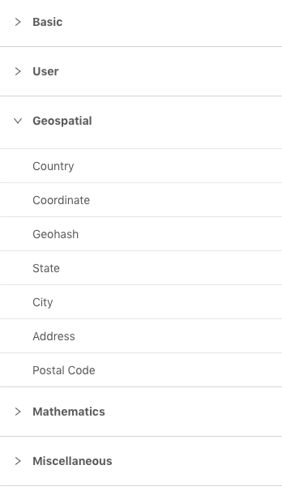
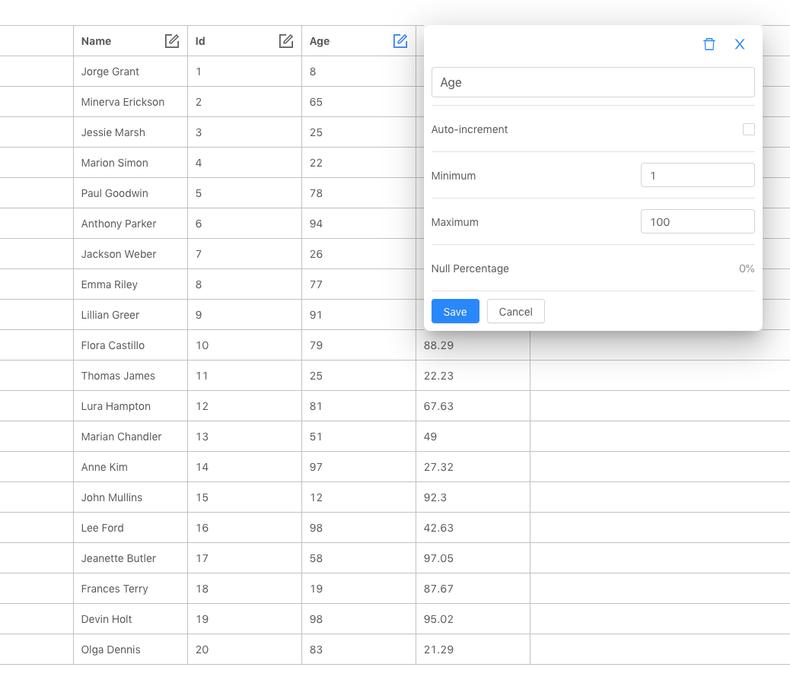

# Introducing DataGin

DataGin is a pseudo-random dataset generator, for all the times during development and testing when you need dummy data in a particular format.
I developed this web application over a few months after getting tired of having to generate custom data to test my applications.
It features a large selection of datatypes and generates data in CSV, JSON, and Excel with just the click of a button.
In this post, I describe briefly the tech stack behind the application. Check it out after the jump.

## The Concept

[DataGin.io](https://datagin.io) generates tabular data from a set of different datatypes chosen by the user.
As of this writing, there are over 40 datatypes, including user names, UUIDs, phone numbers, postal codes, and various probability distributions. When a user selects a datatype, it is added as a column to the data table. From there, the user can rearrange columns and set specific properties on each to further customize the data.

Once a schema has been built, the application can generate a dataset with thousands of rows of data in multiple formats. The data is then downloaded to the user's file system where they are ready to serve as input to another application.

## The Frontend

The frontend was the most labor intensive aspect of DataGin since it needed to be a user-friendly interface for many different datatypes and options.
I created a "preview" of the schema by showing some data rows to the user as soon as the schema gets updated.
This ended up taking the form of a spreadsheet-like table as the primary application screen.
I chose to use a sidebar with tabs to consolidate all of the options.
The entire frontend was created using React.
I used the [react-sortable-hoc](https://github.com/clauderic/react-sortable-hoc) library to make the columns sortable with a smooth drag-and-drop animation.

## The Backend

The backend consists of a NodeJS app running in a Docker container on AWS Fargate. It features an API created using the Koa framework. The generated data is store on S3 and a reference to the location of the data is sent back to the frontend for download. Since the generation should be scalable to large datasets, it is critical that the data is streamed onto S3, while the memory remains constant. For this, I made extensive use of Node's Stream API. By creating Streams, the data can be generated row-by-row in one stream, piped into another stream for formatting as JSON or CSV, and finally piped out to S3.