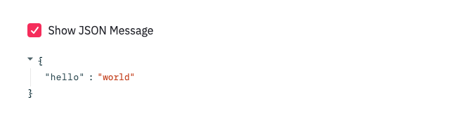

# Streamlit Review

Streamlit is a relatively new tool that enables data practitioners to quickly build interactive data analysis dashboards. It abstracts away all of the details typically associated with UI/UX such as layouts, styling, state management, and callback handlers. What is left is a simple, intuitive API that makes dashboard development accessible to those who are not fluent in frontend frameworks.


## What is it?

Streamlit is similar to Jupyter Notebooks. A Jupyter Notebook lets a developer play with data in a highly iterative manner, where code is written and executed alongside the results that it produces. The problems come when you want to share a notebook with someone who is not familiar with how it works or the language it uses. Or, maybe you would like to control how a user interacts with your notebook. Streamlit addresses these issues by wrapping your data analysis processes in a frontend service that is easily deployable. Others can navigate to a dashboard using their browser. Additionally, it offers intuitive controls to enable the user to tweak and play with data processing and visualization.

Streamlit was designed as a tool for data scientist to create interactive dashboards that would be customized to their particular machine learning models. However, it can also be useful as general data exploration, reporting, and visualizations. I have used Streamlit to create multiple dashboard that query and display data in ways that are useful for common troubleshooting and debugging tasks. It's very useful for sharing data analysis results with team members and other stakeholders.


## How does it work?

Streamlit is a Python library that can be called from a simple script. For example, functions such as `table`, `pyplot`, and `dataframe` will render your data on the dashboard in nicely formatted displays. Other functions such as `button`, `checkbox`, and `slider` will create UI controls to enable users to explore your data iteractively.

Anyone who has created a dashboard understands the mess that comes from callback handlers and state management. The real power behind Streamlit is the carefully designed API that handles these details and keeps the program execution flowing in a linear path that is familiar to Python programmers. For example, the code below shows how input is received from a checkbox.

```python
# app.py

import streamlit

show_json = streamlit.checkbox(label='Show JSON Message', value=True)

if (show_json):
    streamlit.json({ "hello": "world" })

```

Then, launch the Streamlit dashboard by running `streamlit run app.py`.
Streamlit will begin serving on port 8501 (by default) and display the JSON to visiters in a nice, collapsable display.
When a user toggles the checkbox, the code is re-evaluated in a top-down manner.
Notice that there are no callback handlers for the checkbox, no CSS to style the JSON, and the entire state is contained in a variable `show_json`.



For larger dashboards, developers will begin running into issues with data being reprocessed everytime the user iteracts with a widget.
Streamlit has a caching system built in for intermediate computations so that the dashboard remains responsive.
The caching functionality come sin the form of function decorators, which I have found to be both necessary and easy to use.

You can find more in-depth examples and documentation at the Streamlit website or the introductory Medium article linked below.

[Streamlit.io Homepage](https://streamlit.io/)

[Medium - Turn Python Scripts into Beautiful ML Tools](https://towardsdatascience.com/coding-ml-tools-like-you-code-ml-models-ddba3357eace)


## Whats the catch?

While Streamlit is incredibly easy to pick up, this comes at the cost of customizability and advanced functionality. If you don't like the way the buttons look, too bad. Want to organize widgets into a fancy grid, not happening. Significant tradeoffs were made in the design of Streamlit to keep it simple and intuitive. For the most part, I consider this an advantage, but it does not take long before you begin hitting the limits of what is configurable via the API.

## Finally ...

Only a few months following its release, Streamlit has already found a spot in my daily workflow.
Simple dashboards can add significant value to a team with suprisingly little investment.
I expect that Streamlit will become a staple in the data practitioners toolkit alongside other mainstays such as Pandas, Jupyter Notebooks, and Matplotlib.